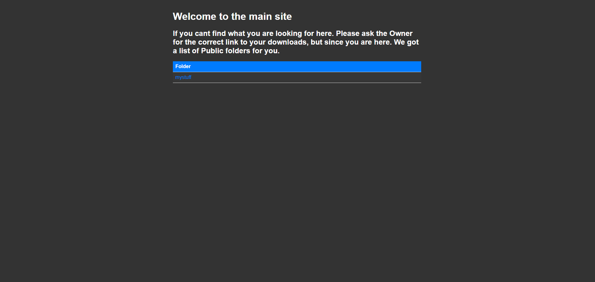
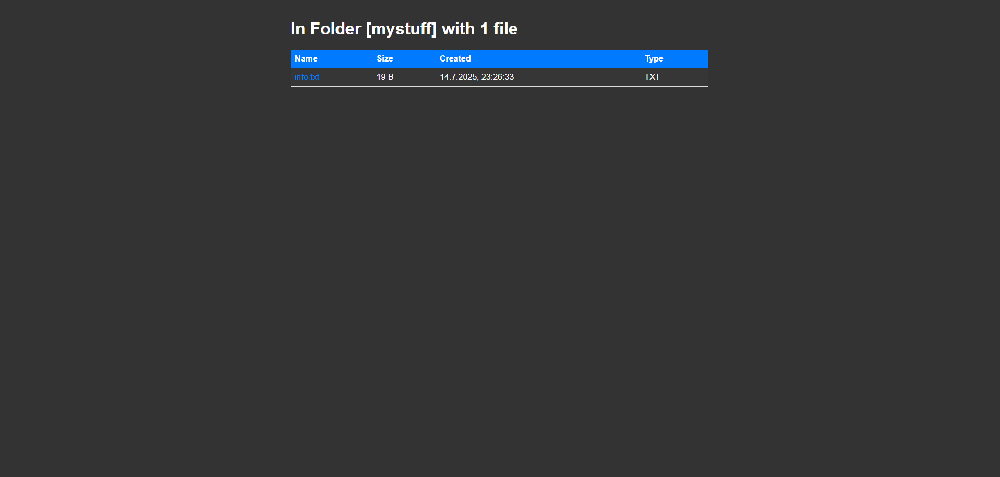
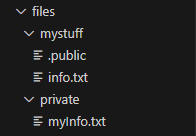

# Simple File Explorer Webserver

This is a minimal Node.js webserver that functions as a simple **file explorer** for the folder named `./files`.

---

## Features

- You can create new subfolders inside `.files` (e.g., `mystuff`).
- Inside each folder, a `.public` file can be created to show this folder on the main page.
- Files and folders inside `.files/<folder>` without a  `.public` file are accessible only via `/foldername` URL path.

---

## Installation

```bash
npm install
```

## Images





Only the folder with .public is shown on the main page.

